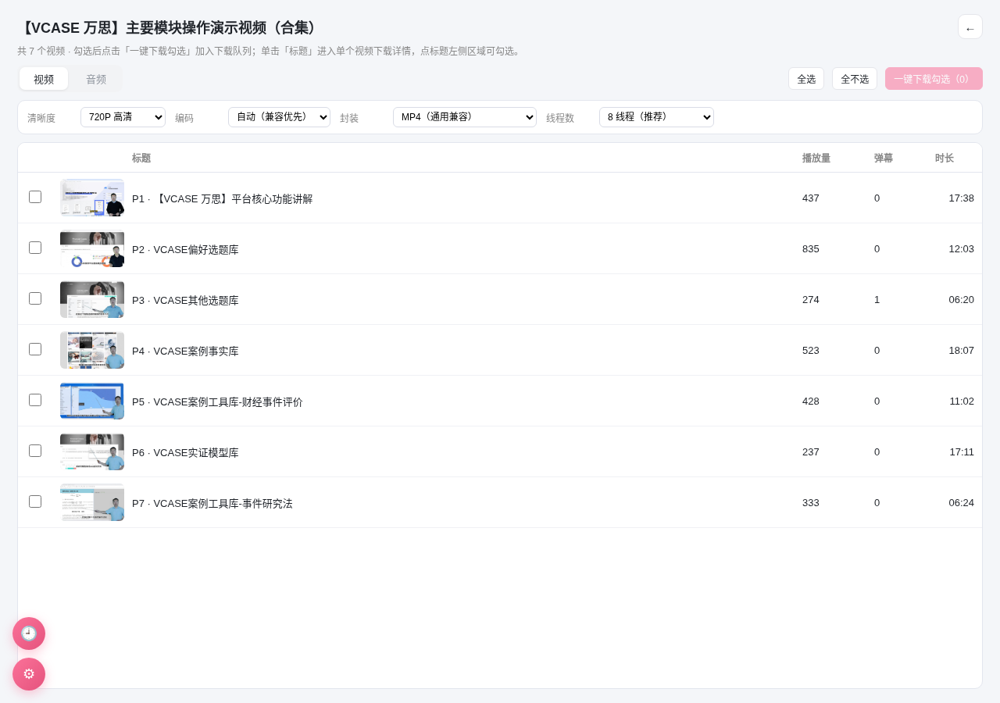
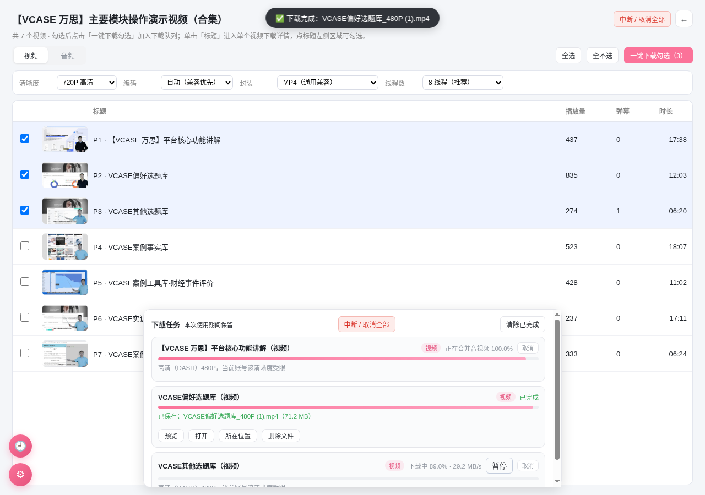
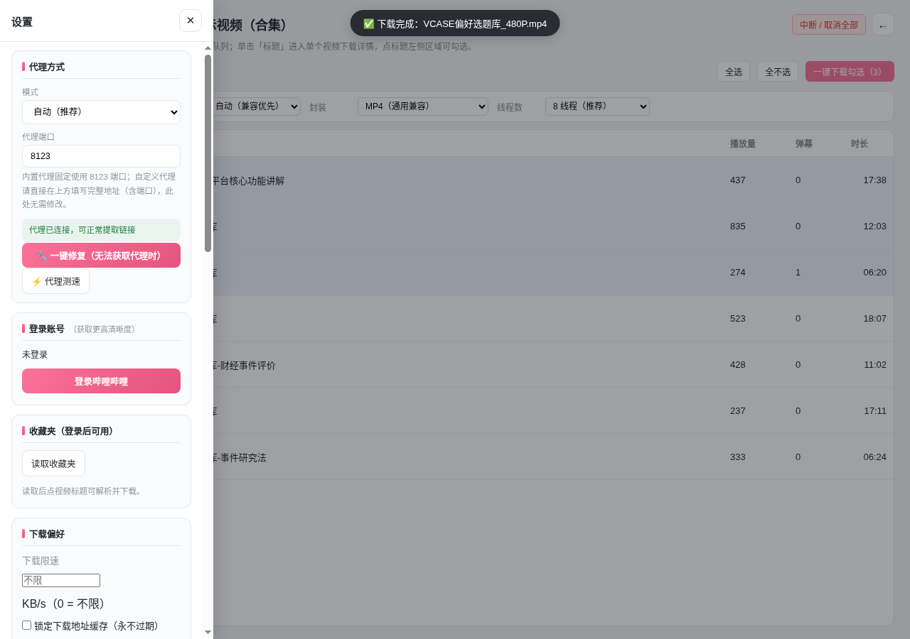

# 哔哩下载器 · GenshinplayerDom

B 站视频 / 音频下载器。Windows 使用 Electron，Android 使用原生 WebView 和下载桥，另附油猴脚本。当前版本 **1.6.7**，作者 GenshinplayerDom，MIT License。

> 本项目基于 **MIT License** 开源。请保留署名「GenshinplayerDom」，并遵循协议条款。

- **视频 / 音频解析**：支持普通视频、分 P、番剧、UP 主合集、收藏夹一键识别与解析。
- **表格列表面板**：合集 / 收藏夹以表格展示（封面、标题、播放量、弹幕、时长），支持勾选 + 全选 / 全不选；单击「标题」进入单个视频下载详情，点标题左侧区域判定为勾选该项，避免误入详情。
- **并发下载调度**：设置「同时下载数上限」（默认 8，按设备内存给出建议，最高 16 线程），超限任务自动排队显示「等待中」，任务完成后自动补位；支持一键中断 / 取消全部。
- **批量下载**：番剧 / 分 P / 合集勾选批量加入队列，逐个视频以单视频方式下载保证成功率；批量面板保留完整下载选项（清晰度、编码、封装、音频格式、线程数）。
- **暂停 / 继续**：桌面端 DASH、直链 MP4 和原版 M4A 下载保留已完成分片，继续时下载剩余部分。
- **一键重试**：失败或取消后重新获取下载地址，保留任务原有的视频、分 P 和设置。
- **同名保护**：桌面端自动追加 `(1)`、`(2)`，并发任务不会覆盖已有文件。
- **下载可靠性**：分片严格校验、备用地址重试、超时、取消和全局连接上限。
- **安全修复**：代理鉴权、请求域名限制、Cookie 加密、标题转义、页面隔离及文件操作限制。
- **在线播放（v1.6.3+）**：视频详情页「返回列表」旁或封面播放三角一键在线播放，默认 1080P（未登录自动 720P）；代理流自动跟随 CDN 302 重定向、Content-Type 兜底、主进程注入 B 站 Referer 规避防盗链，播放失败自动降级（MP4 → 720P）。
- **网络重置（v1.6.6）**：设置页一键重置网络（刷新 DNS / 释放续租 IP / 重置 Winsock 与 IP 堆栈）。短时间向 bilibili.com 发送大量数据流被临时拉黑导致清晰度降级时，重置或切换网络即可恢复。
- **支持作者（v1.6.6）**：设置页底部「支持作者」，弹出微信 / 支付宝收款码。

详细变更见 [ROADMAP.md](ROADMAP.md)，实际完成范围见同文件。

## 现有功能

视频 / 音频解析和下载、分 P / 番剧 / 合集 / 收藏夹批量下载、编码与清晰度选择、**多线程多端并发下载（4–16 线程）**、**软件内搜索（B 站视频搜索，直接加入下载列表）**、**跨重启断点续传（保留分片，重启后自动继续）**、**自动更新检查**、**快捷键（Ctrl+D 下载、全局粘贴识别链接）**、**主题跟随系统（浅色 / 深色 / 跟随）**、**下载任务悬浮窗（可拖动 + 最小化小球）**、**下载队列页（左下入口）**、**左下主菜单一键返回**、下载历史（含历史记录页与一键清空）、M4A 直存、MP3 转码（音质良 / 优 / 极优）、字幕 / 弹幕附带下载、封面与信息导出、MP4 / MKV 封装（完全版保留视频封装选项）、片段裁剪、定时开始、限速、**简易版 / 完全版界面切换**、**设置模块（代理方式、一键修复、多开、登录账号获取更高清晰度、使用教程、开源声明链接）**、主题和设置导入导出。

功能与视频源、平台及账号权限有关。登录不意味着可以获取账号本身没有权限观看的内容。

> **提示**：固定网络中短时间大量下载可能被哔哩哔哩临时拉黑（表现为只能获取低清晰度、下载速度骤降），可在设置页「网络重置」一键重置，或切换网络后重启软件恢复。

| 能力 | Windows | Android / 浏览器 |
| --- | --- | --- |
| 原版音频、直链视频 | 支持 | 支持 |
| DASH 视频与音轨合并 | 内置 FFmpeg | 原生 MediaMuxer 合并 |
| 暂停 / 继续 | 下载阶段支持 | 尚不支持 |
| MP3 转码 | 支持，转码阶段不支持暂停 | 取决于 Web Audio 能力 |
| Cookie 持久化 | 系统加密存储 | Android Keystore；独立网页代理仅内存 |
| 收藏夹 | 支持（表格列表 + 勾选下载） | 同左 |

**跨重启续传**：Windows 端支持，下载中断后分片保留在本地，重启软件自动恢复并继续下载（设置页可查看续传任务）。合并阶段可以取消，不能暂停；重试会重新开始任务。浏览器 MP3 转码仍会占用较多内存。

## 界面预览

**合集 / 收藏夹表格列表面板**（勾选 + 全选 / 全不选 + 完整下载选项）



**并发下载调度**（同时下载数上限 + 排队等待 + 任务卡悬浮，可中断 / 取消全部）



**设置模块**（代理方式 / 一键修复 / 登录账号 / 收藏夹 / 下载偏好）



## 本地运行

需要 Node.js **22.12 或更新版本**：

```powershell
npm ci
npm start
```

Windows 启动后粘贴视频链接。桌面端登录位于设置中；原有明文 Cookie 会迁移至加密存储。系统加密服务不可用时，账号只保留在本次进程内，不再写入明文文件。

单独运行网页版：

```powershell
node server.js
```

然后打开 `http://127.0.0.1:8123/`。代理页面会提供本次会话的认证令牌；不要直接双击 `index.html`。独立代理退出后需要重新登录。内置代理端口被其他程序占用时，请关闭冲突的代理实例后在设置中重启代理。

[MIT](LICENSE) © GenshinplayerDom

```powershell
npm test
npm run assets:android
npm run check
npm run smoke
npm run dist:win
```

Copyright (c) 2026 GenshinplayerDom

FFmpeg 会随依赖安装，并复制到打包后的 `resources/`。其二进制许可证及对应源码信息一并附在 `ffmpeg.LICENSE`、`ffmpeg.README`；项目自身的 MIT 协议不替代第三方组件协议。

## Android 构建

需要 JDK 17 或 21、Android SDK Platform 34 和 Build Tools 34。先同步前端文件：

```powershell
npm run assets:android
$env:JAVA_HOME = '你的 JDK 路径'
$env:ANDROID_HOME = '你的 Android SDK 路径'
cd android
.\gradlew.bat :app:assembleDebug
```

调试 APK：`android/app/build/outputs/apk/debug/app-debug.apk`。

Linux / macOS 使用 `bash ./gradlew :app:assembleDebug`。Wrapper 使用 Gradle 8.7，分发包配置了 SHA-256 校验。

发布构建可通过 `BILI_KEYSTORE`、`BILI_STORE_PASSWORD`、`BILI_KEY_ALIAS`、`BILI_KEY_PASSWORD` 提供自己的签名，再运行 `:app:assembleRelease`。未配置时生成未签名的 release APK；仓库不包含签名密钥或密码。

## 代码结构

- `app.js` / `index.html` / `styles.css`：共用前端。
- `main.js` / `preload.js`：Electron 生命周期、IPC 和文件权限。
- `server.js`：带鉴权的本地代理、WBI 和设备身份处理。
- `lib/downloader.js`：分片下载、校验、重试、暂停 / 取消与连接池。
- `lib/security.js` / `lib/cookie-store.js`：地址、文件和凭据边界。
- `android/`：Android 工程；assets 由 `npm run assets:android` 同步。
- `tests/` / `scripts/smoke.cjs`：核心与界面回归验证。
- `bilibili-downloader.user.js`：油猴脚本（浏览器直用版）。

## 版本历史

- **v1.6.0**：修复批量列表封面（统一 https，兼容协议相对链接）；下载任务悬浮窗可拖动 + 左上角 × 最小化为小球；左下新增下载队列页（实时任务状态 + 回退）；左下新增主菜单一键返回（保留下载任务）。
- **v1.5.0**：软件内搜索（WBI 签名 + 代理优先）、跨重启断点续传、自动更新检查、快捷键（Ctrl+D / 全局粘贴）、主题跟随系统、Android 原生 DASH 高清合并（MediaMuxer，无需 FFmpeg）。
- **v1.4.2**：列表点击判定收窄——仅点击「标题」进入单个视频详情；标题左侧（封面 / 勾选列）点击判定为勾选该项。
- **v1.4.1**：合集 / 收藏夹列表面板补齐完整下载选项（清晰度、编码、封装、音频格式、线程数），一键下载勾选使用列表所选设置。
- **v1.4.0**：合集 / 收藏夹表格列表（勾选 + 全选 / 全不选 + 单击进详情）、并发下载调度（上限 + 内存建议 + 等待补位）、一键取消全部、返回主菜单、简易模式恢复视频详情。
- **v1.3.x**：合集 / 收藏夹批量下载、编码选择、多线程并发提速、下载历史、设置模块等。

## License

[MIT](LICENSE) © GenshinplayerDom。请保留原作者署名与许可证。
